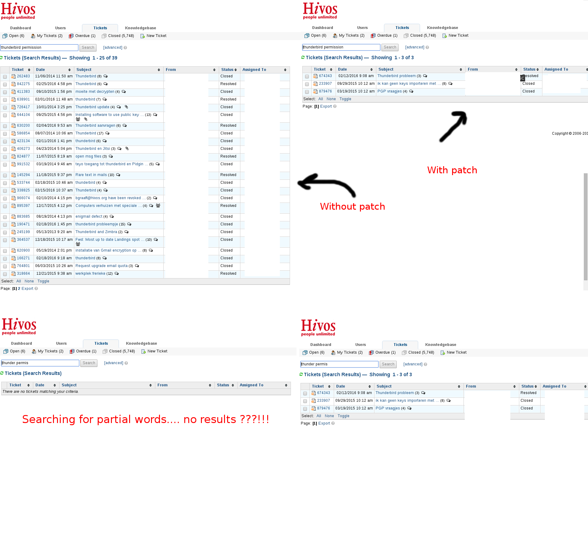

# Search Patch for osTicket 1.8

Below is an unofficial and unsupported patch for the osTicket search function. It replaces ALL the logic behind the search box and advanced search.

  - Allows for partial word search
  - Uses AND logic
  - Does not depend on `ost__search` table
  - Advanced search supported filters: topic, status

The patch uses MySQL features GROUP_CONCAT, CONCAT and LIKE.

### MySQL Views
You also need to create 2 views:

    CREATE OR REPLACE VIEW ticket_title AS
    select ost_form_entry.object_id as ticket_id,  ost_form_entry_values.value as ticket_title
    from 
    ost_form_entry, ost_form_entry_values
    where 
    ost_form_entry.id = ost_form_entry_values.entry_id AND
    ost_form_entry_values.field_id = 20 AND
    ost_form_entry.form_id = 2;

20 Hold Summary Title in my install, you may ned to change to reflect your installation.

2 Holds the Ticket details form, you may ned to change to reflect your installation.

      CREATE OR REPLACE VIEW ticket_search AS 
      SELECT ost_ticket_thread.ticket_id, ost_ticket.topic_id,ost_ticket.status_id,
      GROUP_CONCAT(
        DISTINCT CONCAT(ticket_title.ticket_title,ost_ticket_thread.body) 
        SEPARATOR ';'
      ) ticket_content
      FROM ost_ticket_thread, ticket_title, ost_ticket
      WHERE ticket_title.ticket_id = ost_ticket_thread.ticket_id
      AND ost_ticket.ticket_id = ost_ticket_thread.ticket_id
      GROUP BY ost_ticket_thread.ticket_id;
      
### MySQL Config

You may need to set the limit for group_concat_max_len, default is 1024.

    /etc/mysql/my.cnf
    [mysqld]
    group_concat_max_len=10000

### Apply patch in PHP
The patch is in file osTicket-1.8/include/ajax.tickets.php

Look around line 100 in function function _search($req) {
comment out from line 

    $select = 'SELECT ticket.ticket_id';
   
to 

    $sql=implode(' union ', $sections);
   
And place the new code:

        //Barry de Graaff - Begin patch to replace search handler
        
        $reqwords = explode(" ", db_real_escape($req['query']));
        $where = '';
        foreach ($reqwords as $r)
        {
           $where .= " ticket_content LIKE '%".$r."%' AND";
        }
        $where = preg_replace("/AND$/",'',$where);        

        //Help topic
        if($req['topicId']) {
            $where.=' AND ticket_search.topic_id='.db_input($req['topicId']);
        }

        // Status
        if ($req['statusId']) {
            $where .=' AND ticket_search.status_id='.db_input($req['statusId']);
        }

        $sql="SELECT * FROM `ticket_search` WHERE ".$where." ORDER BY `ticket_id` DESC";
        
        //Barry de Graaff - End patch to replace search handler

If you rather make a diff first, here is my entire version of osTicket-1.8/include/ajax.tickets.php
 [https://gist.github.com/barrydegraaff/b99c3b0a244c39818fd5](https://gist.github.com/barrydegraaff/b99c3b0a244c39818fd5)

### Screenshots

